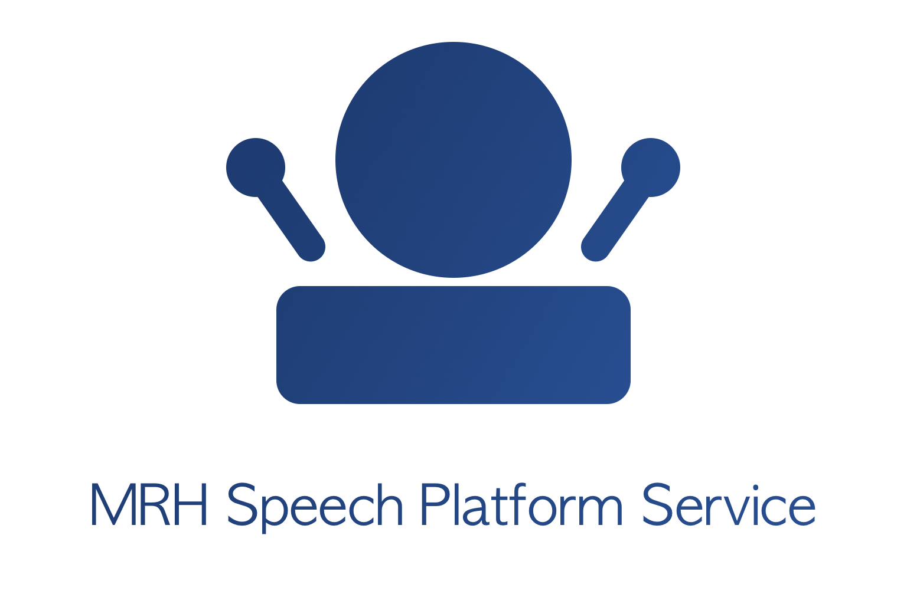

mrhpsspeech
===========

   
The mrhpsspeech platform service handles events of the listen and say category. 
The service reacts to speech output requests from user applications and sends 
speech input to user applications.

Speech input and output is handled by text strings and audio buffers. The service 
will receive and send audio and strings by using a local data stream connecting to 
the actual audio and string source.

Audio processing for both speech input and output is handled with API providers 
from third party sources. These providers might require a internet connection, 
work locally on the machine or both.

.. toctree::
   :maxdepth: 2
   :caption: Contents:

   Service_Info/Service_Info
   Building/Building
   Configuration_File/Configuration_File
   Callbacks/Callbacks
